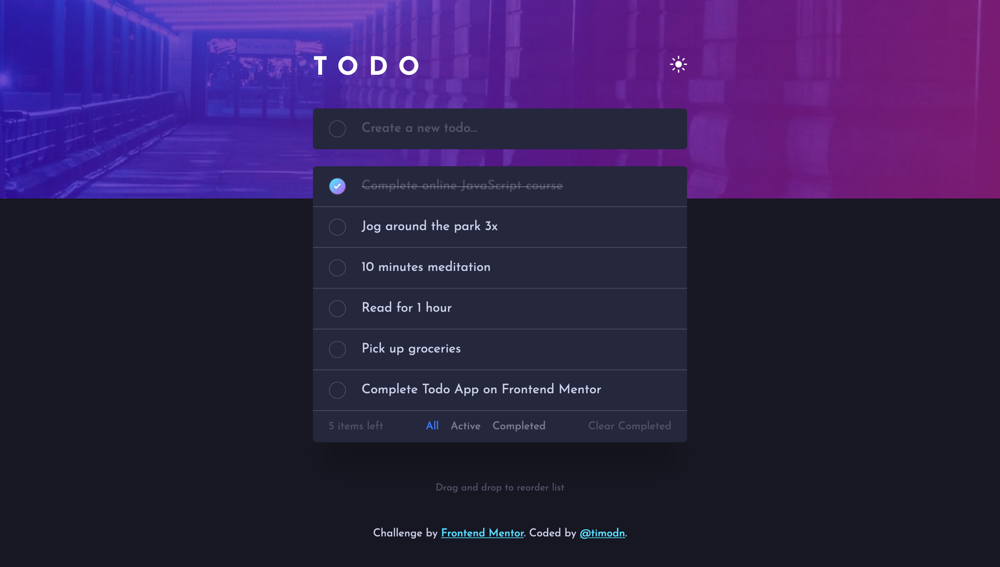

# Frontend Mentor - Todo app solution

This is a solution to the [Todo app challenge on Frontend Mentor](https://www.frontendmentor.io/challenges/todo-app-Su1_KokOW). Frontend Mentor challenges help you improve your coding skills by building realistic projects. 

## Table of contents

- [The challenge](#the-challenge)
- [Screenshot](#screenshot)
- [Links](#links)
- [Built with](#built-with)
- [What I learned](#what-i-learned)
- [Continued development](#continued-development)
- [Author](#author)

### The challenge

Users should be able to:

- View the optimal layout for the app depending on their device's screen size
- See hover states for all interactive elements on the page
- Add new todos to the list
- Mark todos as complete
- Delete todos from the list
- Filter by all/active/complete todos
- Clear all completed todos
- Toggle light and dark mode
- **Bonus**: Drag and drop to reorder items on the list

### Screenshot

### Links

- Solution URL: https://github.com/TimmyOGH/Todo-App
- Live Site URL: https://timmyogh.github.io/Todo-App/

### Built with

- CSS custom properties
- Flexbox
- [React](https://reactjs.org/) - JS library

### What I learned

In this project, I had a chance to work with many useState hooks and React DnD library. I learned quite a lot of useful techniques and implementations during this challenge. I'd love to say that I have truly improved so much in React from this.

### Continued development

I'd love to learn more about React as well as working with CSS frameworks.

## Author

- Frontend Mentor - [@timodn](https://www.frontendmentor.io/profile/timodn)